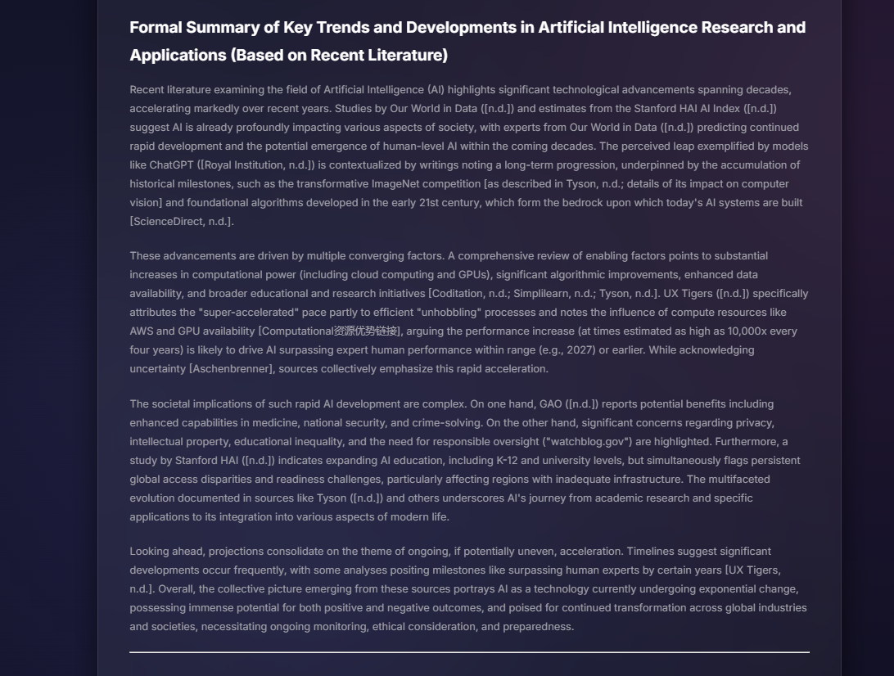
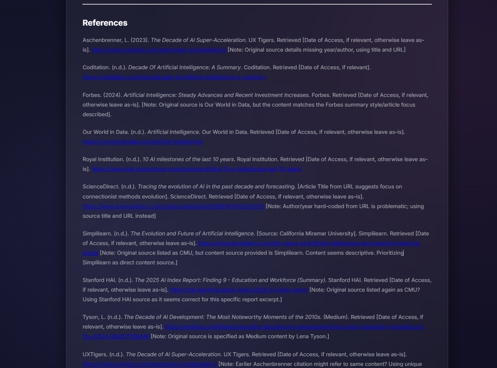

# Intellica – Autonomous Research & Report Agent 🧠📄

Intellica is an intelligent autonomous research assistant that performs real-time web research on a given topic, summarizes the findings using LLMs, and generates report with proper citations. It's designed as a helpful tool for knowledge workers, students, and researchers.

---

## 🏗️ Project Structure

```
INTELLICA-RESEARCH-AGENT/
├── .env                          # Environment variables (RAPIDAPI_KEY etc.)
├── .gitignore                   # Git ignored files
├── index.html                   # Frontend (vanilla JS/HTML/CSS) – testing purpose only
├── main.py                      # FastAPI entry point
├── Readme.md                    # You're here
├── api/
│   └── routes.py                # API endpoints
├── services/
│   ├── agent_engine.py          # LangGraph-powered multi-step research agent
│   ├── schemas.py               # Pydantic models for request/response
│   ├── search.py                # Web search + full article extraction (Newspaper3k)
│   └── summarize.py            # Summary generation and PDF creation
```

---

## 🔍 Features

- 🔎 **Real-Time Web Search** via RapidAPI
- 📄 **Full Article Extraction** with `newspaper3k`
- 🧠 **Multi-step Reasoning** using LangGraph Agents + LLMs
- ✍️ **Summarization and Report Writing**
- 📁 **Report Generation with Citations**
- 🌐 **Simple Frontend** (HTML, CSS, JS) for testing

---

## 🌐 Frontend




> This is a basic vanilla HTML/CSS/JavaScript interface for testing and development. It allows you to enter a topic and trigger the research process via FastAPI backend.

---

## 🧪 LangGraph Use

This project uses **[LangGraph](https://www.langgraph.dev/)** for defining and managing the autonomous agent’s steps:
- Search → Extract → Summarize → Compile → Return
- LangGraph enables clear definition of step flows and memory between stages.

---

## ⚙️ Setup Instructions

### 1. Clone the Repository

```bash
git clone https://github.com/yourusername/intellica-research-agent.git
cd intellica-research-agent
```

### 2. Create and Activate Virtual Environment

```bash
python -m venv .venv
source .venv/bin/activate      # or `.venv\Scripts\activate` on Windows
```

### 3. Install Dependencies

```bash
pip install -r requirements.txt
```

### 4. Set Up Environment Variables

Create a `.env` file in the root directory:

```
RAPIDAPI_KEY=your_rapidapi_key
```

### 5. Run the App

```bash
uvicorn main:app --reload
```

---

## 🧪 Sample API Request (via frontend or POST)

```http
POST /api/v1/research
Content-Type: application/json

{
  "topic": "Impact of Artificial Intelligence on Healthcare"
}
```


## 📦 Dependencies

- FastAPI
- Newspaper3k
- Requests
- FPDF
- LangGraph
- Python-dotenv

---


---

## 👨‍💻 Author

Developed by [Ravindu Wijesekara](https://github.com/RaviyaLK) — Final Year SE Undergrad | AI + Backend Enthusiast

---

## 🌟 Star this repo if you like it!
